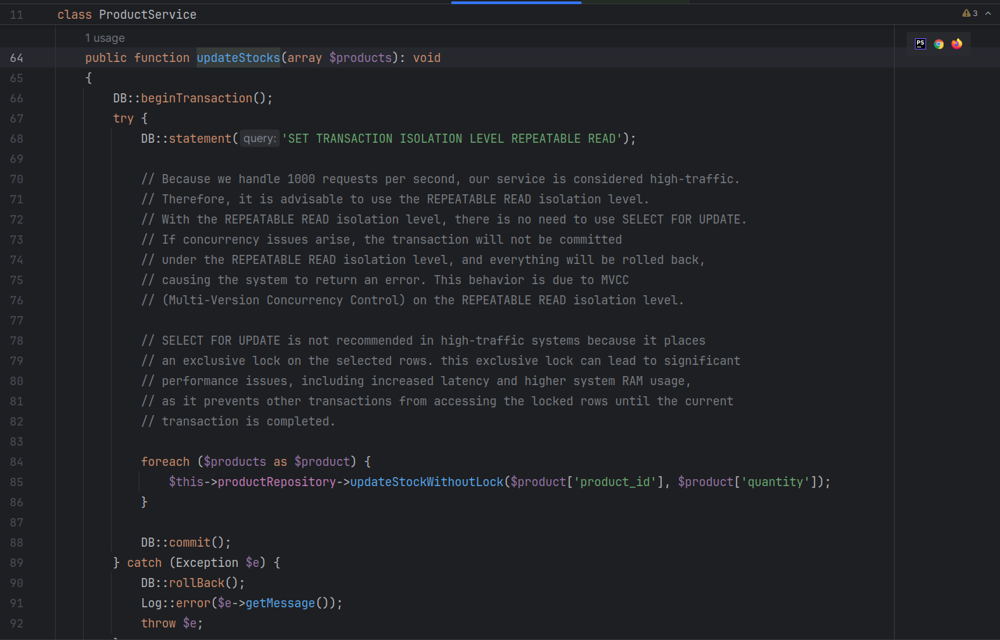

# Introduction

This project consists of three microservices: customer, product, and order. Each microservice handles a specific domain of the application. The project is designed to be scalable and can handle a large number of requests per second without concurrency issues.

## Services

1. Customer Service: Manages customer information.
2. Product Service: Manages product information.
3. Order Service: Manages order information.

## Project commands

1. Build the projects: `make build`
2. Start the projects: `make up`
3. Create databases: `make setup`
4. Run migrations: `make migrate`
5. Stop the project: `make down`
6. Seed the database with fake data: `make seed`
7. Run tests: `make test`

# API Endpoints

## Customer Service

Create a Customer
```bash
curl -X POST 'http://127.0.0.1:8000/api/customers' \
--header 'Content-Type: application/json' \
--data-raw '{
    "name": "john doe",
    "email": "john.doe@gmail.com"
}'
```

Get a Customer by ID
```bash
curl -X GET 'http://127.0.0.1:8000/api/customers/1'
```

## Product Service

Create a Product
```bash
curl -X POST 'http://127.0.0.1:8001/api/products' \
--header 'Content-Type: application/json' \
--data '{
    "name": "ruler",
    "price": "3.5",
    "stock": 35
}'
```

Get All Products
```bash
curl -X GET 'http://127.0.0.1:8001/api/products'
```

Get a Product by ID
```bash
curl -X GET 'http://127.0.0.1:8001/api/products/1'
```

## Order Service

Create an Order
```bash
curl -X POST 'http://127.0.0.1:8002/api/orders' \
--header 'Content-Type: application/json' \
--data '{
    "customer_id": 1,
    "products": [
        {"id": 1, "quantity": 1}
    ]
}'
```

# Notes

- This project was developed in a short period, and there are areas that need improvement, such as error handling and logging systems.
- Authentication is not implemented in any part of the project as it was not specified in the task description.
- These services do not encounter concurrency issues. However, other methods could have been used to handle concurrency, such as transactional outbox or two-phase commit.
- In the product retrieval section, we can design using CQRS (Command Query Responsibility Segregation) to separate the read model and write model, thereby increasing the read and write speed for the product service.

I also explained in the code how I handled the concurrency issue. My suggestion was to use the isolation level 'repeatable read'.


